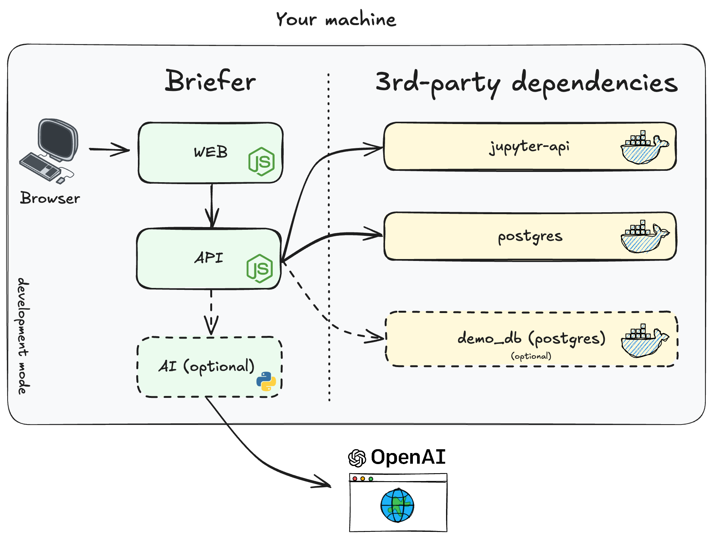

# Contributing Guidelines

In this document, you'll learn how to run Briefer in development mode and how to contribute to the project.

<br />

### Contents

- [Running Briefer in dev mode](#computer-running-briefer-in-dev-mode)
- [Questions, bugs, and feature requests](#bulb-questions-bugs-and-feature-requests)
- [Submitting pull requests](#repeat-submitting-pull-requests)
- [Troubleshooting](#wrench-troubleshooting)

> **This guide serves to set clear expectations for everyone involved with the project so that we can improve it together while also creating a welcoming space for everyone to participate. Following these guidelines will help ensure a positive experience for contributors and maintainers.**

<br />

## :computer: Running Briefer in development mode

You need to be able to run Briefer in development mode to contribute to the project and test changes.

<p>
<picture align="center">
  <source  align="center" media="(prefers-color-scheme: dark)" srcset="../assets/img/briefer-dev-mode-dark.png">
  <source align="center" media="(prefers-color-scheme: light)" srcset="../assets/img/briefer-dev-mode.png">
  
</picture>
</p>

> [!NOTE]
> If you're looking to deploy Briefer, you can check our [deployment guide here](./DEPLOYMENT.md). This guide is focused on running Briefer in _development_ mode.

Below are the steps to run Briefer in development mode.

<br />

### 1. Install native dependencies

Briefer runs on [Docker](https://www.docker.com/), so you'll need to have it installed on your machine. If you don't have it yet, you can download it [here](https://www.docker.com/get-started).

Briefer also uses [Docker Compose](https://docs.docker.com/compose/), so make sure you have it too. In more recent versions of Docker, Compose is already included.

Besides that, you'll need to have [Node.js](https://nodejs.org/) (we currently use Node v18) and [Yarn](https://yarnpkg.com/) installed on your machine. You can download them [here](https://nodejs.org/) and [here](https://yarnpkg.com/), respectively.

<br />

### 2. Start the database, jupyter instance, and demo database

After installing the dependencies, you'll have to run the database, Jupyter instance, and demo database to which Briefer will connect.

To do that, run the following command in the root folder of the project:

```bash
./start-dev.sh
```

This command will create the necessary `.env` files and run the `docker-compose.dev.yaml` file.

<br />

### 3. Install Briefer's dependencies and start it

Finally, you'll need to install Briefer's dependencies and start the project.

To do that, run the following commands in the root folder of the project:

```bash
yarn install
```

After installing the dependencies, you can start Briefer by running:

```bash
yarn dev
```

<br />

### 4. (Optional) Running the AI service

Briefer's AI service is a separate service that generates code for the AI features, like _"Edit with AI"_ and _"Fix with AI"_. You don't necessarily need to run it, unless you're working on these features or want to use them.

To run it, you'll need to have [Python 3.9](https://www.python.org/) installed on your machine.

After installing Python, we recommend creating a virtual environment to install the dependencies of the AI service.

```bash
cd ai
virtualenv venv
```

After creating the virtual environment, you can activate it by running:

```bash
source venv/bin/activate
```

Then, you can install the dependencies by running:

```bash
# you may need to `brew install mysql pkg-config` before
pip install -r requirements.txt
```

Finally, you can start the AI service by running:

```bash
python3 main.py
```

<br />

#### Troubleshoting

Here are a few things to try if you have trouble running Briefer in development mode.

1. Ensure you're running the latest version of Docker and Docker Compose.
2. Double-check that you have Node.js and Yarn installed, and make sure that you're using Node v18.
3. Reinstall the dependencies by removing the `node_modules` folder and running `yarn install` again. Please ensure that you're running Node v18 during the installation.
4. If you're having trouble running the AI service, ensure that you have Python 3.9 installed and that you've created a virtual environment for it. Also, make sure that you've installed the dependencies by running `pip install -r requirements.txt`.
5. If you can't find the necessary `.env` files within each app's folder, try running `./start-dev.sh` again.
6. In case the applications complain about missing environment variables, you can always delete the `.env` files and run `./start-dev.sh` again to recreate them.

If you still can't run Briefer properly after following these instructions, please open an issue [here](https://github.com/briefercloud/briefer/issues).

<br />

## :bulb: Questions, bugs, and feature requests

At Briefer, we'd rather have you ask questions than wander around in the dark or waste time on something that could be easily solved.

**Do not be afraid to ask questions. We are here to help you!**

Here's when you should, ideally, open an issue:

- You've found a bug in Briefer.
- You have a feature request.
- You can't run Briefer in development mode.
- You're having trouble deploying Briefer.

In all other cases, we'd recommend that you get in touch using [our Slack community](https://join.slack.com/t/briefercommunity/shared_invite/zt-2geo5vlh2-RxEOwCRrVEz6JDkrPHuf0g). If you're not part of it yet, you can join by clicking [here](https://join.slack.com/t/briefercommunity/shared_invite/zt-2geo5vlh2-RxEOwCRrVEz6JDkrPHuf0g).

In any case, either by opening an issue or asking a question in our Slack community, please provide as much information as you can. This will help us help you.

Finally, if you're not sure whether you should open an issue or ask a question on Slack, just do what feels right to you - it's all good. :v:

<br />

### :lock: Reporting Security Issues

If you've found a security issue in Briefer, please don't open an issue. Instead, send an email to [founders@briefer.cloud](mailto:founders@briefer.cloud) or open the Vunerability Report using the Security tab in this repository.
Additionally read our [Security Policy](./SECURITY.md)

<br />

## :repeat: Submitting pull requests

Anyone can submit a pull request to Briefer. We welcome contributions from everyone, regardless of their experience level.

If you're new to open-source or to Briefer, you can start by looking at the issues labeled as `good first issue`. These issues are usually smaller and easier to tackle, making them a great starting point for new contributors.

When opening a pull request, please make sure to fill the template with as much information as you can. This will help us understand your contribution and review it more effectively.

After submitting a pull request, please make sure to sign [our CLA (Contributor License Agreement)](./CLA.md) by following the instructions that our bot will provide you. This is a necessary step for us to accept your contribution.

<br/>

## :wrench: Troubleshooting

Below are some common errors and their possible fixes. Please feel free to open an issue if none of these suggested fixes work.

<details>
  <summary>Jupyter permissions issue on Linux/WSL</summary>

This error usually manifests as the following message:

```
RuntimeError: Permissions assignment failed for secure file: '/home/jupyteruser/.local/share/jupyter/runtime/jpserver-8.json'. Got '0o677' instead of '0o0600'.
```

This message typically means that the folder doesn't exist or that the user doesn't have the required permissions. To fix this issue, update the permissions as in the example below.

```bash
mkdir -p ./jupyterfiles
sudo chown -R $(whoami):$(whoami) ./jupyterfiles
mkdir -p ./jupyterfiles/.local/share/jupyter
```

After running the commands above, restart the Jupyter server container to apply the changes.

</details>
