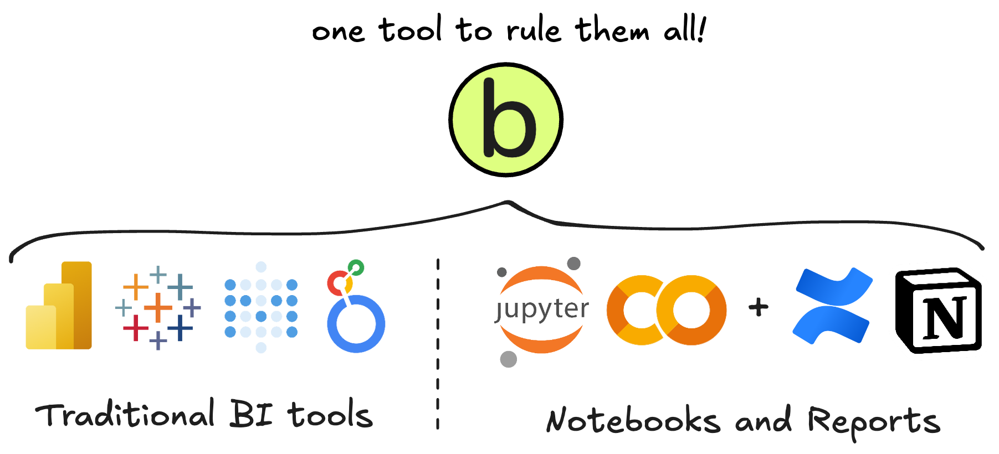
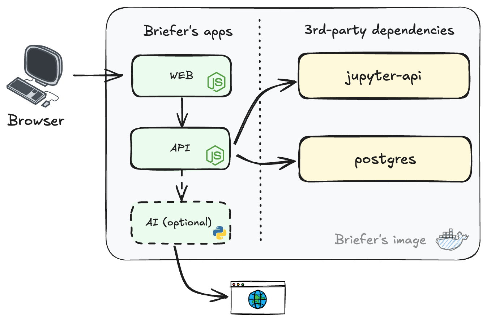
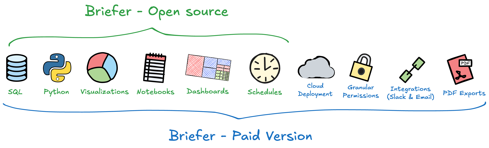

<p align="center">
  <h1 align="center">❇️ Briefer</h1>

  <p align="center">
    Notebooks and dashboards with Python, SQL, scheduling, native visualizations, code generation, and more.
  </p>

  <p align="center">
    <a href="https://join.slack.com/t/briefercommunity/shared_invite/zt-2geo5vlh2-RxEOwCRrVEz6JDkrPHuf0g" target="_blank">Slack</a>
    |
    <a href="https://briefer.cloud" target="_blank">Website</a>
    |
    <a href="https://briefer.cloud/blog" target="_blank">Blog</a>
    |
    <a href="https://github.com/briefercloud/briefer">Issues</a>
    |
    <i><a href="https://app.briefer.cloud" target="_blank"><strong>Try the cloud version »</strong></a></i>
  </p>
</p>

<p align="center">
   <a href="https://github.com/briefercloud/briefer/stargazers" target="_blank"></a>
   <a href="https://pypi.org/project/briefer/" target="_blank"></a>
   <a href="https://github.com/briefercloud/briefer/blob/main/LICENSE"></a>
   <a href="https://www.ycombinator.com/companies/briefer"></a>
</p>

---

<i>Here's a brief demo (no pun intended) of Briefer. It may take a few seconds to load.</i>

https://github.com/user-attachments/assets/dfc6c1ef-f26c-44a9-8566-857178a8c5db

---

Briefer is like Notion for code notebooks and dashboards. It gives technical users all the flexibility they need to publish dashboards, analyze data, create reports, and build data apps. At the same time, Briefer makes it easy for non-technical users to view and interact with data.

In Briefer, you can:

- 📚📊 **Create notebooks and dashboards** using Markdown, Python, SQL, and native visualizations.
- 🤳 **Build interactive data apps** using inputs, dropdowns, and date pickers.
- 🤖 **Generate code and queries** using an AI that understands your database schema and your notebook's context.
- 🕰️ **Schedule notebooks and dashboards** to run and update periodically.
- ⚙️ **Create and test ad-hoc pipelines** using writebacks.

In addition to all that, Briefer is also multiplayer, meaning two or more people can work on the same notebook or dashboard at the same time and see each other's changes in real-time.

<br />

## Quick Start

The recommended way to run Briefer locally is to install it using `pip` and run it using the `briefer` command. Please note that Briefer requires [Docker](https://www.docker.com) to run, so make sure you have it installed before running the commands below.

```bash
# Install Briefer
pip install briefer

# Run Briefer and access it on http://localhost:3000
briefer
```

If you run Briefer using `pip`, our initialization scripts will take care of downloading [our docker image](https://hub.docker.com/r/briefercloud/briefer), setting up volumes to store Briefer's data, and starting the application.

Alternatively, you can also run Briefer using Docker directly:

```bash
# Run Briefer using Docker
docker run -d \
  -p 3000:3000 \
  -p 8080:8080 \
  -v briefer_psql_data:/var/lib/postgresql/data \
  -v briefer_jupyter_data:/home/jupyteruser \
  -v briefer_briefer_data:/home/briefer \
  briefercloud/briefer
```

These volumes are for Briefer to store its data, including its pages, dashboards, schedules, and users. If you want to remove Briefer's data, you can remove these volumes.

For more information on how to deploy Briefer in production, please refer to our [deployment guide](/docs/DEPLOYMENT.md).

If you want to contribute to Briefer, please read our [contributing guide](/.github/CONTRIBUTING.md) which explains how run Briefer in development mode.

<br />

## How do I use Briefer?

Briefer is a collaborative web application. Each instance of Briefer can have multiple users who share a workspace containing multiple pages.

Ideally, you'll deploy Briefer somewhere where your team can access it, like a server or a cloud provider. Once you have Briefer running, you can access it on your browser and start creating pages.

To fetch external data in Briefer, you can connect it to your databases, like PostgreSQL, BigQuery, Redshift, Athena, or MySQL. You can also upload any types of files and work with them as if they were on disk.

<br />
<p>
<picture align="center">
  <source  align="center" media="(prefers-color-scheme: dark)" srcset="./assets/img/briefer-usage-overview-dark.png">
  <source align="center" media="(prefers-color-scheme: light)" srcset="./assets/img/briefer-usage-overview.png">
  
</picture>
</p>
<br />

You can view each Briefer page as a notebook or a dashboard.

**In the notebook mode**, you can write SQL to fetch data, Python to manipulate or visualize it, and Markdown to document your analysis. You can also use native visualizations to create charts and tables without having to write code.

Then, **in the dashboard mode**, you can create dashboards by dragging and dropping the elements from your notebook. You can also add inputs, dropdowns, and date pickers to create interactive filters or data apps.

After you're done creating your notebook or dashboard, you can publish your changes so that other users can see them.

Once a page is published, you'll be able to schedule it to run periodically so that your dashboards and notebooks are always up-to-date.

<br />

## How is Briefer different from other tools?

There are two types of tools people usually compare us against. The first type is traditional BI tools like Tableau, Looker, or Power BI. The second type is notebooks like Jupyter, or Google Colab, whose results often get screenshoted and pasted in Notion or Confluence.

<br />
<p>
<picture align="center">
  <source  align="center" media="(prefers-color-scheme: dark)" srcset="./assets/img/one-tool-dark.png">
  <source align="center" media="(prefers-color-scheme: light)" srcset="./assets/img/one-tool.png">
  
</picture>
</p>
<br />

Here's how Briefer compares to each of them.

<br />

### Briefer vs. Traditional BI Tools

Briefer is better than traditional BI tools because it's faster and more flexible, thanks to Python.

Traditional BI tools often require you to write complex SQL queries to fetch data, and then limit you to a set of pre-defined visualizations. Most of the time, the only way to manipulate these visualizations is by clicking around the UI, which can be slow and error-prone.

Briefer supports SQL and no-code visualizations too, but it also allows you to write Python code to manipulate data and create custom visualizations.

This means you can do things like:

- Fetch data from multiple sources and join them together without having to create a data pipeline beforehand
- Hit APIs to gather data or enrich your own
- Use machine learning to include predictive analytics in your dashboards

Additionally, many data and engineering teams end up splitting their work between a BI tool and a jupyter notebook. That makes it hard to keep track of what's happening and to collaborate effectively. In Briefer, you can do everything in one place.

<br />

### Briefer vs. Traditional Notebooks

We love notebooks, but there are three main problems with them:

1. They're difficult to share and maintain, especially with non-technical people.
2. They require local credentials and lots of boilerplate code to fetch data from databases or APIs.
3. Their UX is far from ideal: you don't have integrated scheduling or code generation, for example.

#### Sharing notebooks with Briefer

The main problem with notebooks is that they're difficult to share and maintain, especially with non-technical people. Therefore, data scientists, analysts, and engineers often struggle to share their work and get the visibility they deserve within their organizations.

Usually, the only way to share a notebook is to take screenshots and paste them in Notion or Confuence. That workaround is not ideal because it's time-consuming, and the information quickly becomes outdated, especially when you need to update it.

Briefer solves this problem because every Briefer notebook is stored in a single place that everyone in your organization can access. Briefer's interface is also much more user-friendly than Jupyter, which makes it easier for non-technical people to view and interact with data.

In addition to Briefer's friendly interface, you can also choose which blocks of your notebook you want to publish, so you can keep your data jiu-jitsu private while sharing the relevant insights and visualizations with your team.

#### Fetching data with Briefer (+ automatic data frames)

Currently, people who want to gather data in notebooks have to keep credentials in their machines, which is not secure. They also have to write a lot of boilerplate code to run simple queries. Sometimes, people create whole libraries to handle queries.

In Briefer, you can run SQL queries against connected data sources directly in your notebook. Then, **Briefer will automatically turn your query into a data frame and store it in a variable that you can use in your Python blocks**.

If you need to fetch data from an API, you can use Briefer's environment variables to store your credentials securely in a single place instead of handing them out to everyone in your organization.

Finally, in case you want to use files, you can upload them to Briefer and read them in Python or query them using SQL thanks to our [DuckDB](https://github.com/duckdb/duckdb) integration.

#### UX improvements in Briefer

Besides our improved interface, Briefer integrates several UX improvements directly into your notebooks.

In Briefer, you can schedule your notebooks to run periodically. That way, you don't have to turn them into an ad-hoc script that you schedule with cron or Airflow. Each of these scheduled runs generates a snapshot that you can use to compare changes over time.

Finally, Briefer can generate code for you. If you're not sure how to write a query or a Python block, you can ask Briefer to generate it for you. Briefer will look at your database schema and your notebook's context to suggest changes. If you run into an error, Briefer can also suggest fixes.

<br />

## Briefer's architecture

Briefer is an application with three main components: the `web`, the `api`, and an optional `ai` service. These three components require a PostgreSQL database to store their data, and a jupyter server to run your code.

<br />
<p>
<picture align="center">
  <source  align="center" media="(prefers-color-scheme: dark)" srcset="./assets/img/briefer-arch-overview-dark.png">
  <source align="center" media="(prefers-color-scheme: light)" srcset="./assets/img/briefer-arch-overview.png">
  
</picture>
</p>
<br />

The `web` is the main interface of Briefer. It's where you create and edit your notebooks and dashboards. The `web` is a [Next.js](https://nextjs.org/) application that communicates with the `api` to fetch and save data.

Besides responding to `web`'s requests, the `api` is also responsible for running your notebooks and dashboards, and fetching data from the data sources you add to Briefer. The `api` is a Node.js application.

Finally, the optional `ai` service is a Python service that generates code for the AI features, like _"Edit with AI"_ and _"Fix with AI"_. You don't necessarily need to run it, unless you're working on these features or want to use them. Please note that using the `ai` service requires an admin to configure an OpenAI API key under the `Settings` page. This service does make requests to OpenAI's API.

<br />

## More information

### Licensing and open-source

**Briefer's open-source offering is licensed under the AGPLv3 license**. This license allows you to use Briefer for free, but it requires you to open-source any changes you make to the codebase under the same license. Your notebooks and dashboards are yours, and you can do whatever you want with them.

Briefer's cloud offering is a separate piece of software that we host and maintain. It's _not_ open-source, but it's free to use and includes additional features like email and Slack integrations, more granular permissions, and SSO.

<br />
<p>
<picture align="center">
  <source  align="center" media="(prefers-color-scheme: dark)" srcset="./assets/img/paid-vs-oss-dark.png">
  <source align="center" media="(prefers-color-scheme: light)" srcset="./assets/img/paid-vs-oss.png">
  
</picture>
</p>
<br />

You can read more about our licensing decisions and open-source philosophy [in this blog post](https://briefer.cloud/blog/posts/open-source-strategy/). To summarise, we'll aim to include all data-related features in the open-source version and save integrations and granular permissions for the cloud version.

### Anonymous telemetry and updates

Briefer collects anonymous telemetry that we use to improve our product. This telemetry includes only event counts and a randomly generated ID for each user. We don't collect any personal information or data from your notebooks, dashboards, queries, or prompts.

You can opt-out of telemetry by setting the environment variable `DISABLE_ANONYMOUS_TELEMETRY` to `true`. To also disable the periodic requests that Briefer makes to check for updates, you can set the environment variable `DISABLE_UPDATE_CHECK` to `true`.

### F.A.Q.

<details>
  <summary>Can I use the cloud version for free instead?</summary>

Yes you can. The cloud version is free to use and includes unlimited documents and all the core features of Briefer.

You can sign up for the cloud version [here](https://briefer.cloud) and read more about our pricing [in our pricing page](https://briefer.cloud/pricing).

</details>

<details>
  <summary>What are the differences between the open-source and cloud versions?</summary>
  The main difference between the open-source and cloud versions is that the cloud version is a hosted service that we maintain and update. Additionally, the cloud version supports multiple workspaces, has more granular permissions, email and Slack integrations. Our enterprise tier also includes SSO.

In any case, Briefer's open-source version includes all the most important features, like SQL, Python, visualizations, writebacks, notebooks, dashboards, scheduling, and code generation.

Our goal is for the open-source version to be fully functional and ideal for teams up to approximately a hundred people. That's why granular permissions and integrations are reserved for the cloud version.

</details>

<details>
  <summary>How easy is it to self-serve in Briefer?</summary>

Briefer is easy to self-serve in the sense that it's pretty straightforward for anyone with a basic knowledge of SQL to fetch data and create visualizations. If someone doesn't know SQL, they can also use the AI assistant to generate queries for them.

Still, we don't believe that _any_ tool can be 100% self-serve. That's because even if people manage to create a query and fetch data, non-technical users usually can't validate or interpret the results without some context. [We've written a detailed blog post about this theme here](https://briefer.cloud/blog/posts/self-serve-bi-myth/).

</details>

<details>
  <summary>How can I get in touch?</summary>

You can reach out to us on [Slack](https://join.slack.com/t/briefercommunity/shared_invite/zt-2geo5vlh2-RxEOwCRrVEz6JDkrPHuf0g) or by email at [founders@briefer.cloud](mailto:founders@briefer.cloud).

We personally read and respond to every message we receive, so don't hesitate to reach out if you have any questions or feedback.

If you need a demo or want to learn more about how Briefer could help, you can book some time [here](https://calendly.com/lucasfcosta/briefer-intro-call).

</details>
