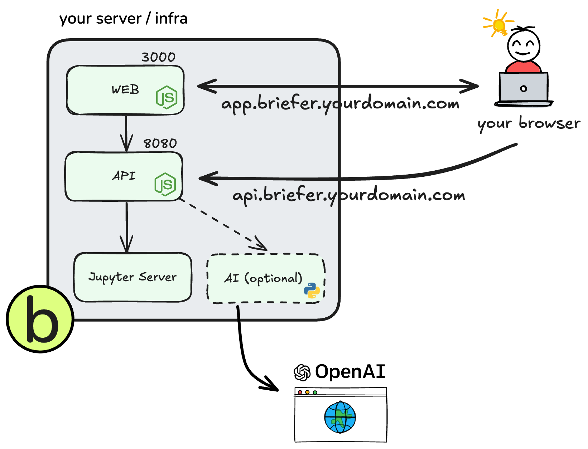

# Briefer's Deployment Guide

In this document we'll cover the most important aspects of deploying Briefer to a production environment.

<br />

## Introduction

Briefer is a web application designed for multiple people to use.

Ideally, you should deploy it to a server that is accessible to all the people who will view and create reports and dashboards, like an EC2 instance on AWS, a droplet on DigitalOcean, or a virtual machine on Azure.

<br />
<p>
<picture align="center">
  <source  align="center" media="(prefers-color-scheme: dark)" srcset="../assets/img/briefer-usage-overview-dark.png">
  <source align="center" media="(prefers-color-scheme: light)" srcset="../assets/img/briefer-usage-overview.png">
  
</picture>
</p>
<br />

Briefer deployments have the following components:

- A web application that users will access in their browsers.
- An API that the web application will talk to.
- A database to store the data that users upload.
- A Jupyter server that runs the actual code.
- An optional AI service that runs the AI features like code generation and automatic fixes.

After deploying Briefer, you'll access the web application in your browser and it'll talk to the API. In turn, the API will talk to the database and the Jupyter server, which are not exposed.

<br />
<p>
<picture align="center">
  <source  align="center" media="(prefers-color-scheme: dark)" srcset="../assets/img/deployment-overview-dark.png">
  <source align="center" media="(prefers-color-scheme: light)" srcset="../assets/img/deployment-overview.png">
  
</picture>
</p>
<br />

In this guide, we'll cover the three recommended ways to deploy Briefer:

1. Deploy Briefer as a single container on an remote server.
2. Deploy Briefer as a multiple containers on an remote server.
3. Deploy Briefer into Kubernetes.

If you're not sure which option to choose, we recommend starting with the first one.

<br />

### Alternative 1: Deploying briefer as a single container on a remote server (recommended for small deployments)

This is the simplest way to deploy Briefer. You'll only need to install Docker on your server and run a single command to start the application.

Then, you'll have to make sure that this server is accessible to all the people who will use Briefer.

Here's a step-by-step guide to deploy Briefer as a single container:

1. Get a machine and SSH into it.
2. Install Docker on the machine.
   ```bash
   # On an EC2 instance, for example
   sudo yum update -y
   sudo yum install docker -y
   sudo systemctl start docker
   ```
3. Pull and run the all-in-one Docker image for Briefer.

   ```bash
    docker run -d \
      -p 3000:3000 \
      -v briefer_psql_data:/var/lib/postgresql/data \
      -v briefer_jupyter_data:/home/jupyteruser \
      -v briefer_briefer_data:/home/briefer \
      briefercloud/briefer
   ```

   ℹ️ If you want to serve Briefer over HTTP (usually because you're using an IP directly) you should consider setting `--env ALLOW_HTTP="true"` in the above command.

4. Expose your server to the internet or your local network.
   Make sure that you allow traffic on port 3000.
5. (Optional) If you want to use a domain name rather than an IP, create the necessary DNS records to access port 3000. Otherwise, skip this step.

<br />

### Alternative 2: Deploying Briefer as multiple containers on an remote server (recommended for medium or large deployments)

Besides deploying Briefer as a single container, you can also deploy it as multiple containers. That way, you'll have separate containers for the web application, the API, the AI service, the database, and the Jupyter notebook server.

This approach is more complex than the previous one, but it allows you to configure each container separately.

That way, you can scale each part of the application independently or just change the configuration of one part without affecting the others. If you want to use an RDS instance for the database, for example, you can do that by changing the configuration of the database container.

Here's a step-by-step guide to deploy Briefer as multiple containers:

1. Get a machine and SSH into it.
2. Install Docker on the machine.
   ```bash
   # On an EC2 instance, for example
   sudo yum update -y
   sudo yum install docker -y
   sudo systemctl start docker
   ```
3. Run `start.sh` to start all the containers.
   ```bash
   ./start.sh
   ```
4. Expose your server to the internet or your local network.
   Make sure that you allow traffic on port 3000.
5. (Optional) Create DNS records to make it easier to access Briefer.

If you want to use an RDS instance for the database, you will need to:

1. Comment-out the `postgres` service in the `docker-compose.yml` file.
2. Change the `POSTGRES_PRISMA_URL` environment variable in the `db_migration` service to point to your RDS instance.
3. Change these variables in the `api` service:
   - `POSTGRES_USERNAME`: username for logging into the RDS database.
   - `POSTGRES_PASSWORD`: password for logging into the RDS database.
   - `POSTGRES_HOSTNAME`: hostname of the RDS instance.
   - `POSTGRES_PORT`: port of the RDS instance.
   - `POSTGRES_DATABASE`: name of the RDS database.

<br />

### Alternative 3: Deploying Briefer into Kubernetes

If you're already using Kubernetes, you can deploy Briefer into your cluster. This approach is more complex than the previous ones, but it allows you to keep Briefer in the same place as the rest of your applications.

We haven't yet published Kubernetes manifests for Briefer, but you can use the `docker-compose.yml` file as a starting point to create your own manifests.

If you're interested in contributing to Briefer, we'd love to have your help in creating Kubernetes manifests for the project.

<br />

## Troubleshoting

If you have any issues deploying Briefer, please have a look at these common issues.

In case you need assistance, please don't feel shy to open an issue. We're here to help.

<details>
  <summary>I can't access the web application</summary>

If you're not able to access the web application, Briefer is either not running or not exposed to the internet (or within your local network). The latter is the most common issue.

To check if Briefer is running, SSH into your server and run `docker ps`. You should see a container using the image `briefercloud/briefer` or `briefercloud/briefer-web`. If you don't see it, Briefer is not running.

If Briefer is running, have a look at its logs and see if there are any errors. You can do that by running `docker logs <container_id>`, where `<container_id>` is the ID of the Briefer container.

Finally, make sure that you've exposed your server to the internet or your local network. You can do that by allowing traffic on port 3000 and creating the necessary DNS records to access the host.

</details>

<details>
  <summary>I can access the web application, but it can't talk to the API</summary>

In this case, it's likely that the web process is running, but the API is not.

If the API is running, have a look at its logs and see if there are any errors. You can do that by running `docker logs <container_id>`, where `<container_id>` is the ID of the API container or the monolithic Briefer container in case that's what you're using.

Check if it complains about any missing environment variables or if there's any other straightforward error that you can solve.

If you can't figure out what's happening, please [open an issue here](https://github.com/briefercloud/briefer/issues).

</details>

<details>
  <summary>I can access the web application, but the sign-in is not working</summary>

If you're running Briefer in another machine, for example an external server, Raspbery Pi, etc - make sure you have enabled HTTPS for your current setup while accessing Briefer on port `3000`.

In case you can't enable HTTPS or just want to try it out, you can run Briefer over HTTP by setting the `ALLOW_HTTP` environment variable to `true`:

```sh
ALLOW_HTTP=true briefer
```

Note that using `ALLOW_HTTP` will _not_ set the session cookie as Secure, thus allowing you to sign in using HTTP. We don't recommend using this option production.
</details>
